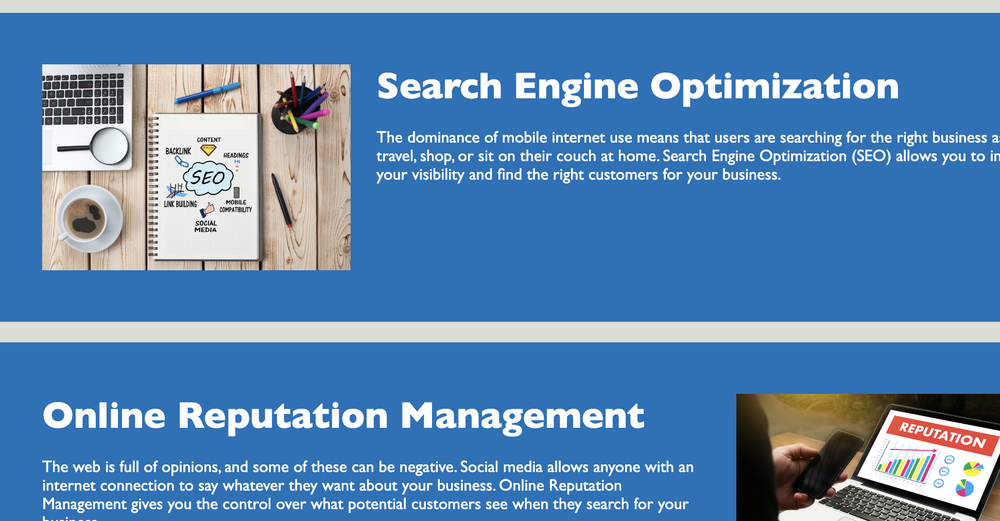

# React Portfolio 
  
## Description

This project is a marketing agency web application which codebase follows accessibility standards
the site is optimized for search engines.

## Table of Contents

- [Usage](#usage)
- [Questions](#questions)

## Usage

WHEN I view the source code  
THEN I find semantic HTML elements  
WHEN I view the structure of the HTML elements  
THEN I find that the elements follow a logical structure independent of styling and positioning  
WHEN I view the image elements  
THEN I find accessible alt attributes  
WHEN I view the heading attributes  
THEN they fall in sequential order  
WHEN I view the title element  
THEN I find a concise, descriptive title  
WHEN I click the options in the navigation bar on the web page    
THEN I am taken to the corresponding title in the main content part  
 
 

## Deployment

Application has been deployed on Github. Please click this link to start using: https://gulama2008.github.io/marketing-agency-web-app/

## Questions

If you have additional questions, please contact me at: 

My github link: https://github.com/gulama2008

My email address: siyu.liu.job@gmail.com